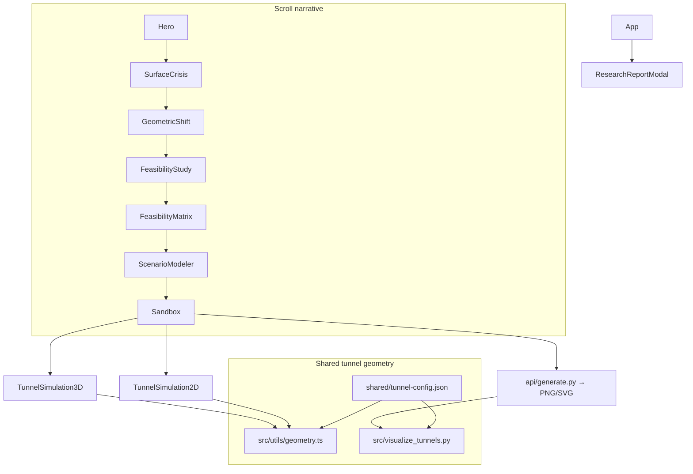

# UrbanDeep — Underground Tunnel Intersection Map

Interactive research site and engineering simulator for **small-diameter (~12 ft) subterranean transit** at **4-way urban intersections** in Indian metros, modeled under **left-hand traffic (LHT)** rules.

The app combines a guided feasibility narrative (congestion, geometry, policy, comparative analysis) with a **Simulation Lab** that renders the same tunnel network in **2D canvas** and **3D WebGL**, plus optional **SVG/PNG export** via a Python/Matplotlib API.

## Architecture



## Key concepts

- **LHT portal placement:** Entry/exit portals offset to the left of travel direction.
- **Depth strata:** L-1 shallow left turns (−15 ft), L-2 primary straights (−30 ft), L-3 deep right turns (−45 ft).
- **12 routed movements:** All straight, left, and right combinations across N/S/E/W approaches.
- **Offset straights:** Straight tunnels are laterally separated at the core to reduce intersection congestion (`straightOffset` in shared config).

Constants and route tables live in **`shared/tunnel-config.json`**. The routing algorithms are implemented in both TypeScript (live sim) and Python (static export); run `npm run test:geometry` to verify they stay aligned.

## Project structure

| Path | Purpose |
|------|---------|
| `src/` | React app (Vite), sections, simulators |
| `src/utils/geometry.ts` | Tunnel network builder for 2D/3D sim |
| `src/visualize_tunnels.py` | Matplotlib schematic renderer |
| `shared/tunnel-config.json` | Single source of truth for dimensions & routes |
| `api/generate.py` | Vercel serverless handler for SVG/PNG export |
| `scripts/compare_geometry.py` | TS ↔ Python alignment test |
| `docs/` | Research copies and architecture notes |
| `public/` | Static assets (research markdown served to the modal) |

## Getting started

### Prerequisites

- **Node.js** 18+ and npm (required for the web app)
- **Python** 3.9+ with dependencies from `requirements.txt` (only for CLI export and `/api/generate`)

### Web app (primary workflow)

```bash
npm install
npm run dev
```

Open [http://localhost:5173](http://localhost:5173).

Other scripts:

```bash
npm run build      # production bundle
npm run preview    # preview production build
npm run lint       # Biome check
npm run test:geometry   # verify TS and Python networks match
```

### Static diagram export

**On Vercel (production):** the Simulation Lab export buttons call:

```
GET /api/generate?setback=75&dark=true&format=svg
```

Query parameters: `setback` (feet), `dark` (`true`/`false`), `format` (`svg` | `png`).

**Locally:** the Vercel Python function is not started by `vite` alone. Use the CLI instead:

```bash
python3 -m venv .venv && source .venv/bin/activate
pip install -r requirements.txt
python3 src/visualize_tunnels.py --setback 75 --dark --output-png artefacts/schematic.png --output-svg artefacts/schematic.svg
```

CLI options:

| Flag | Description |
|------|-------------|
| `--dark` | Dark blueprint theme |
| `--setback <ft>` | Portal setback distance (default from `tunnel-config.json`) |
| `--output-png <path>` | PNG output path |
| `--output-svg <path>` | SVG output path |

## Simulation Lab controls

- **Portal setback** — distance from intersection edge to portal boxes
- **Traffic density** — number of animated pods in the network
- **Sim speed** — animation multiplier
- **2D / 3D** — engineering schematic vs. stratified WebGL view

## Research report

The in-app **Research** modal loads `public/indian-urban-tunnel-transit-feasibility-study.md`. A copy may also exist under `docs/`; keep `public/` in sync if you edit the study.

## Documentation

See **[docs/ARCHITECTURE.md](docs/ARCHITECTURE.md)** for system design, geometry contract, deployment, and contributor notes.

## License

Private project (`package.json` → `"private": true`). See repository owner for usage terms.
